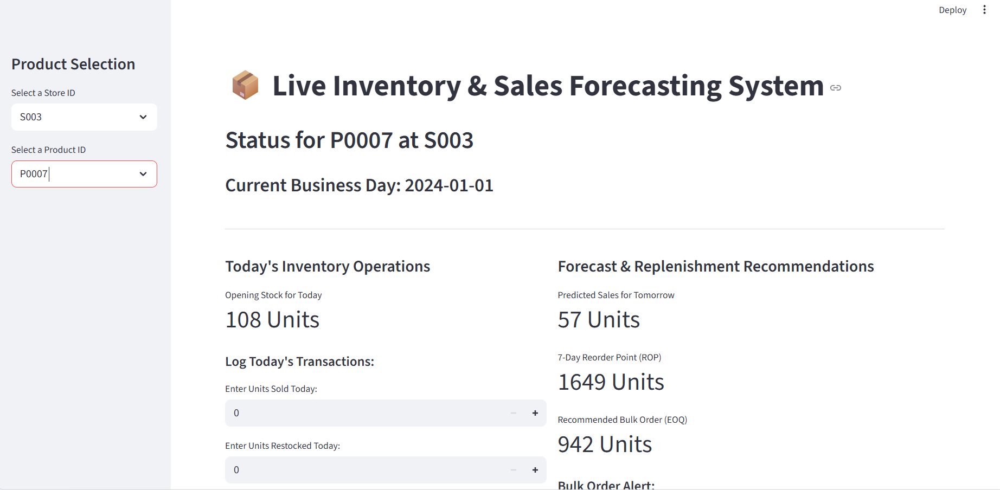
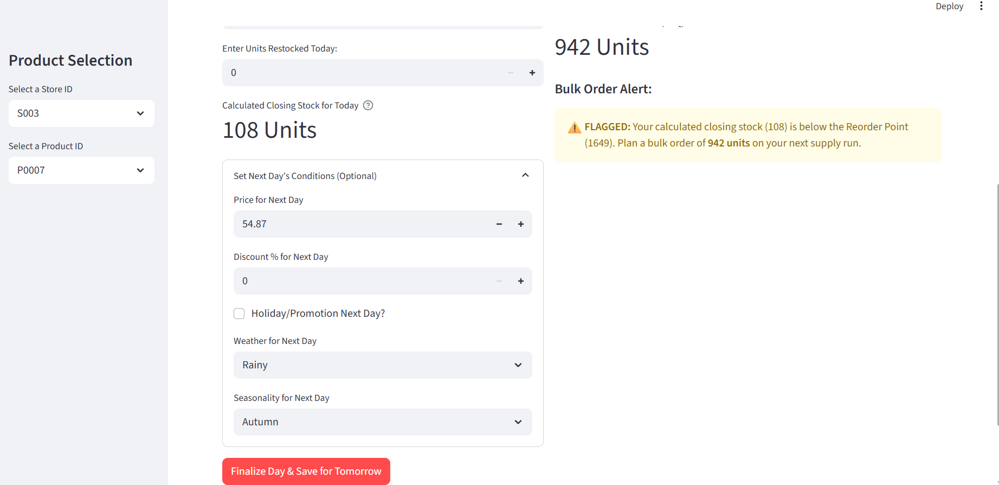
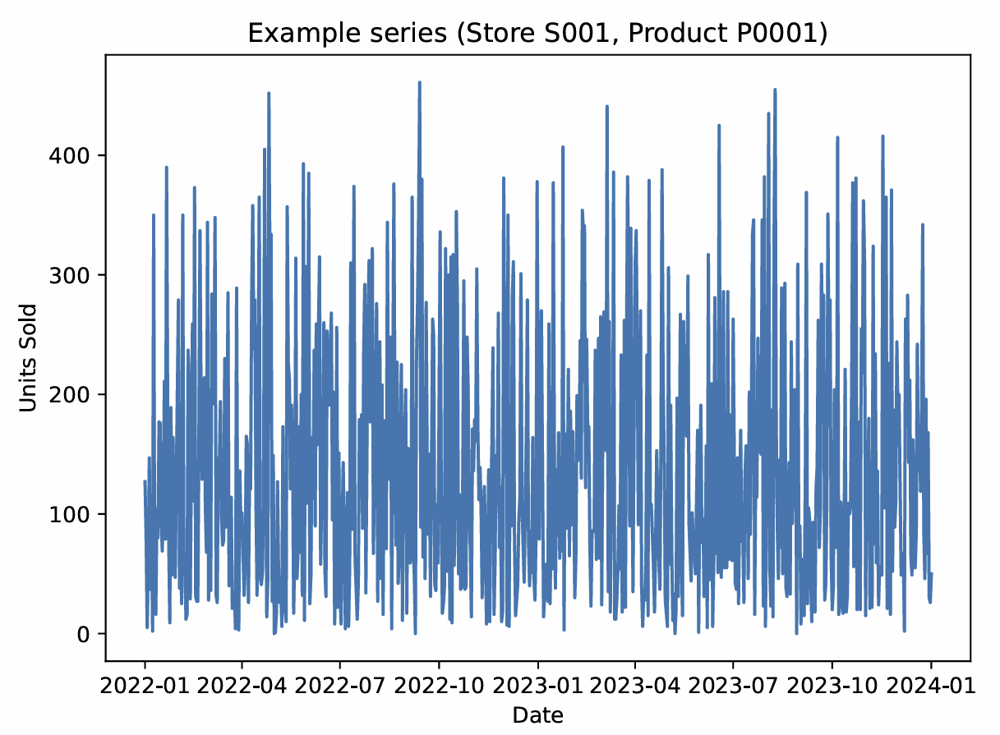
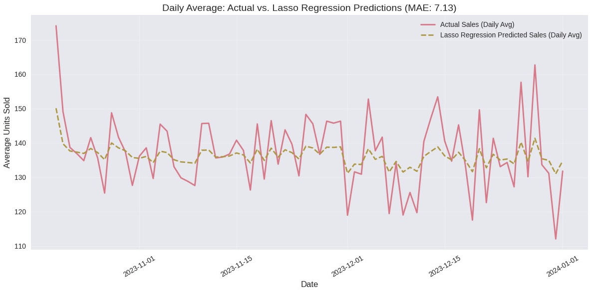
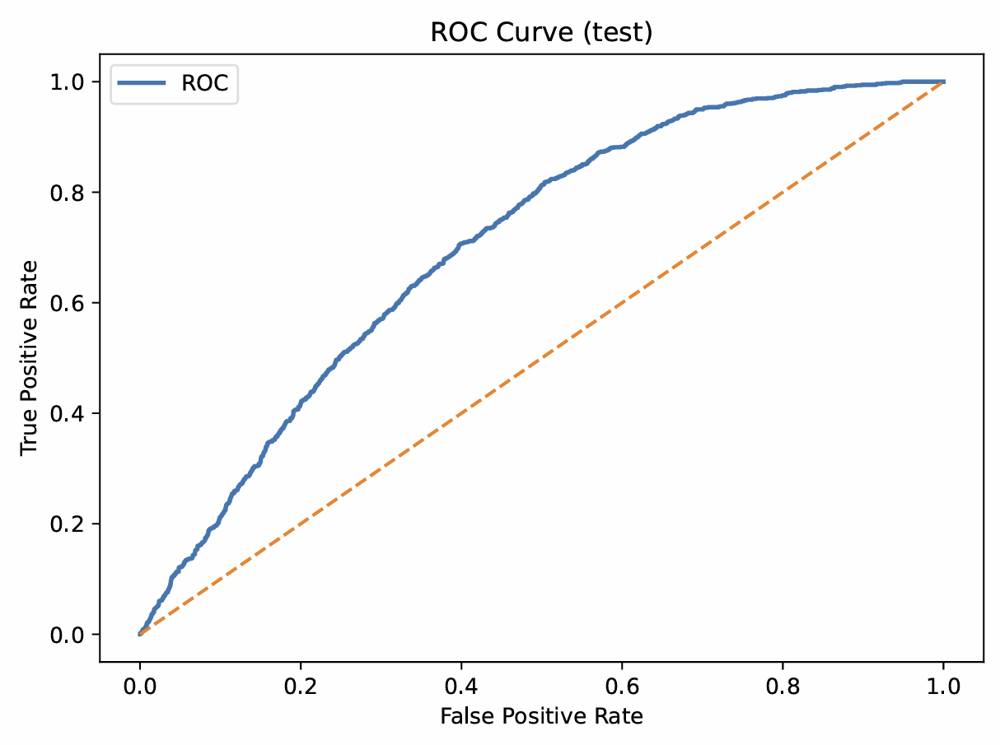
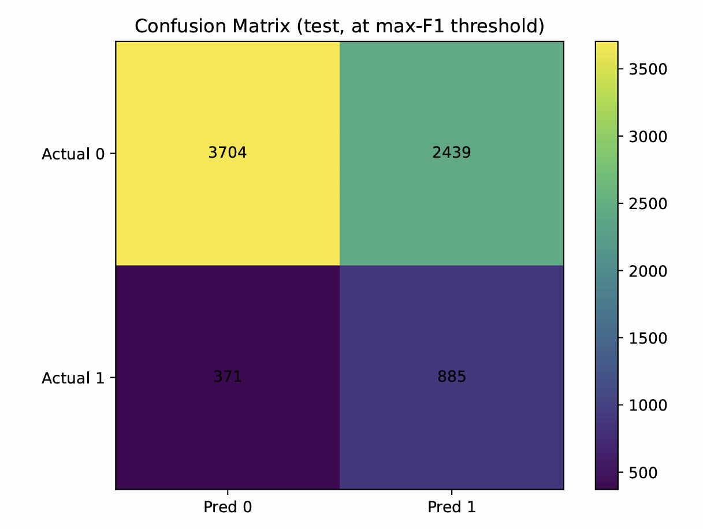

# Data-Driven Retail Inventory Management

A practical decision-support system for retail inventory that combines **short-horizon demand forecasting**, **stockout-risk estimation**, and **EOQ/ROP-based replenishment recommendations**. The project includes a lightweight dashboard UI for store–product selection and actionable reorder alerts.

> **Availability:** Dataset and full implementation code are available **upon reasonable request**.

---

## What this project does
- Forecasts next-day sales demand for a selected store and product
- Estimates stockout risk during lead time
- Computes **Reorder Point (ROP)** and **Economic Order Quantity (EOQ)**
- Triggers a **bulk order alert** when expected stock falls below ROP
- Presents outputs through a simple UI/dashboard

---

## Repository Structure
- `assets/ui/` — dashboard screenshots  
- `assets/results/` — model/result snapshots  
- `docs/` — methodology notes (PDF)  
- `src/` — demo script (synthetic data only)

---

## UI (Dashboard)



---

## Results (Snapshots)





---

## Demo (No Data)
A minimal demo script is included to show the end-to-end pipeline using **synthetic data** (no dataset required).

```bash
pip install numpy pandas scikit-learn
python src/demo.py
```
Documentation: [Methodology Notes](docs/Methodology_Notes.pdf)

Availability (Data + Full Code)

Due to data-sharing restrictions, the dataset and full source code are available upon reasonable request for academic/research use.
Contact: rifata562@gmail.com
